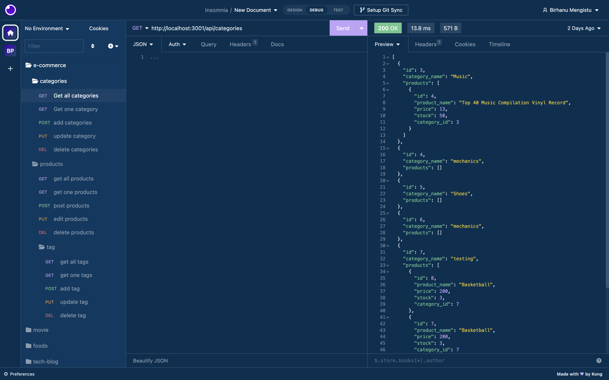

# E-commerce

# README Generator
## Description
welcome to the ecommerce back end where using an api you can manage products,categories and tag. The application uses sequelize and express to route the database to the server and clinet. This app also consists of node.js and mysql. I had to use a many to many relationship between tags and products. This app has a fully functioning CRUD.
    
## Screenshot

## Table of Contents
* [Installation](#installation)
* [Usage](#usage)
* [License](#license)
* [Contributors](#contributors)
* [Tests](#tests)
* [Questions](#questions)
    
## Installation
1. run npm i
2. change the env.example file to .env and add password
3. run the mysql schema file
4. run npm run seed   
5. node/nodemon.server.Js and start the server

## Usuage
TO use the app follow the steps above and you should be able to use. After the installation you Can be able to test the fully functioning CRUD.

## License
MIT

## Contributions
Birhanu Mengistu

## Tests
N/A

## Questions

How to reach me:

Github : https://github.com/linotmike

Email : linotmike.mk@gmail.com

## Links

Github repo: https://github.com/linotmike/README-gen

    
